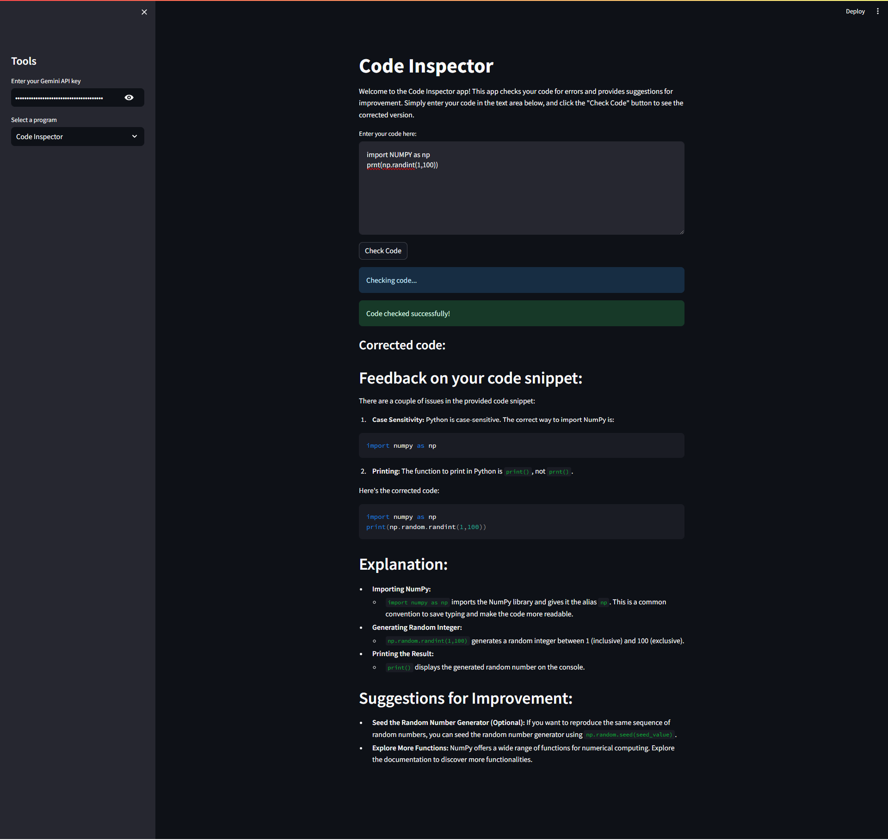
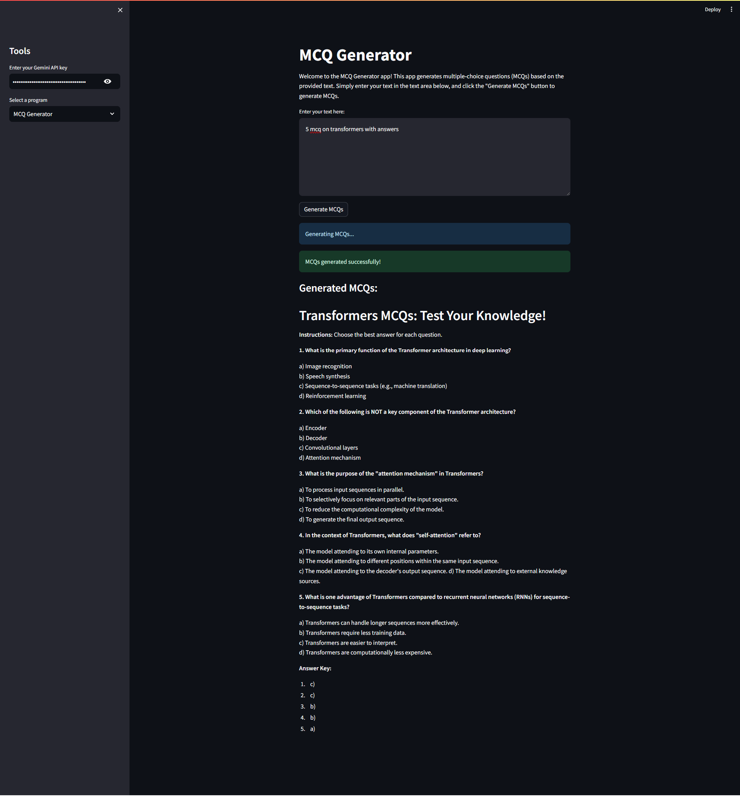
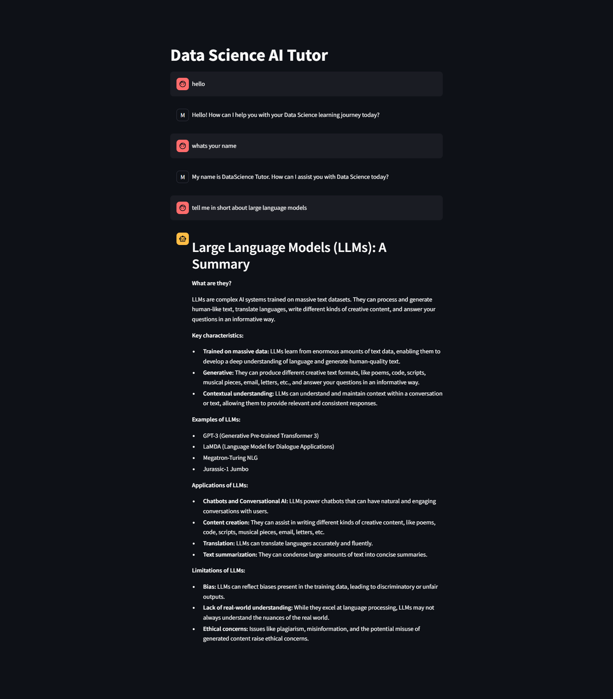

# GuideKit

Guide Kit is a versatile Streamlit app that offers multiple tools for code inspection, MCQ generation, and Data Science AI tutoring, all powered by Google's Generative AI technology.

## Installation

1. Clone this repository.
2. Install dependencies using `pip install -r requirements.txt`.
3. Run the app using `streamlit run gemini_genai_app.py`.

## Usage

1. Enter your Gemini API key in the sidebar.
2. Select a program from the sidebar: Code Inspector, MCQ Generator, or Data Science AI Tutor.
3. Follow the instructions provided by each program to interact with it.

## Configuration

Before running the app, obtain a Gemini API key and enter it in the sidebar.

## Screenshots

### Code Inspector
*The Code Inspector tool provides developers with instant feedback and actionable suggestions to enhance the quality of their code.*

### MCQ Generator
*The MCQ Generator tool automates the process of creating multiple-choice questions (MCQs) for study materials and assessments.*

### Data Science AI Tutor
*The Data Science AI Tutor serves as a virtual guide for individuals embarking on their Data Science journey, providing clear explanations and real-world examples.*

